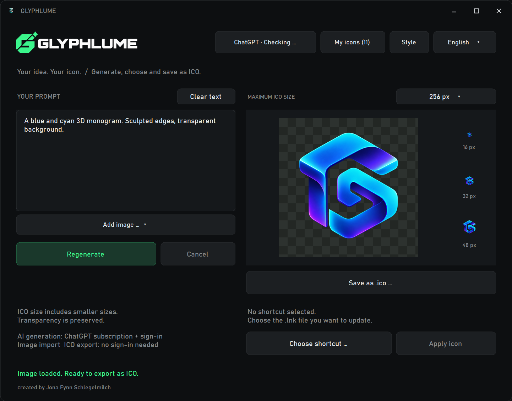

<!-- workspace-navigation-20260921 -->
## Projekt-Einstieg · GLYPHLUME

| Gesucht | Pfad |
| --- | --- |
| Orientierung fuer Agents | [PROJECT_MAP.json](<PROJECT_MAP.json>) |
| Quellcode | [.](<./>) |
| Verbindliche Projektregeln | [AGENTS.md](<AGENTS.md>) |
| Build-Einstieg | [build.ps1](<build.ps1>) |
| Pruefstand / Anleitung | [docs/DELIVERY-2026-09-21.md](<docs/DELIVERY-2026-09-21.md>) |
| Git-Repository | `.` |
| App starten | [GLYPHLUME](<GLYPHLUME.exe>) |
| Gemeinsame Module | [app-kit.plan.json](<app-kit.plan.json>) |
| Lokale Pakete / Builds | `dist` |

Ordnung vom 21.09.2026: Bestehende Quell-, Build-, Start- und Datenpfade bleiben
erhalten. Paketordner behalten ihre bisherigen Namen, damit Scripts und alte
Aufgaben weiter passen. Fertige EXEs/Pakete sind lokale Lieferdateien, keine
neuen Git-Quellen. Bewusst gepinnte SDK-Dateien bleiben Build-Abhaengigkeiten.
Vor Git-Aktionen den angegebenen Repository-Ordner verwenden. Aeltere
Entwicklungskopien nicht ungeprueft ueber diesen Stand kopieren. Kein Upload
und keine neue Designfreigabe durch diese Ablagepflege.
<!-- /workspace-navigation-20260921 -->

# GLYPHLUME

A small Windows desktop app for creating, collecting and exporting icons.



## Features
- Prompt-based icon generation through the installed Codex CLI and an existing ChatGPT/Codex subscription.
- Real Windows ICO export with 16, 24, 32, 48, 64, 128 and 256 px entries; choosing a maximum includes smaller offered sizes.
- PNG/JPG/BMP/ICO import with a centered square crop and ICO export without signing in.
- Named icon libraries, multiple selection and batch copying to new or existing libraries, portable set ZIP export/import, and existing images as AI references.
- Explicit shortcut selection before applying an icon.
- Customizable colors, fonts, logo and layout details; German and English UI.

## Prompt refinement and shape masks

- **Refine** uses the existing Codex sign-in to propose a clearer icon brief. Review and edit the suggestion, then Apply or Discard. It uses a text request, never an automatic image request. Cancel preserves your prompt and image. Reference edits retain all details outside the requested change.
- Generation includes small-icon design defaults while respecting explicit background, text and style requests.
- **Shape mask** offers None, Circle, Rounded square and Hexagon. It center-crops to a square and makes the area outside the shape transparent with antialiased edges. Existing alpha is preserved. None restores the untouched source in the current preview.
- Preview, ICO export, shortcut application and adding the preview to a library use the masked image. Loading a gallery entry starts with None (library images may already contain a baked mask). Original generation files are unchanged.
- Masks work offline. They clip a geometric shape; they do not remove the background inside that shape.

## Build and run
Windows with .NET Framework 4.x and the included Framework C# compiler is required.

```powershell
.\build.ps1
.\GLYPHLUME.exe
```

Keep `assets/Glyphlume.png` beside the app in the `assets` folder. Settings and generated work are saved locally in `data`; applied icons are stored in `Icons`. The app folder must be writable.

For AI generation, install Codex with its CLI and sign in with an account that supports image generation. The app does not bundle Codex or credentials. Generation requires internet and uses the account's available quota. Other AI providers are not integrated.

## Local checks

```powershell
.\GLYPHLUME.exe --self-test
```

This validates ICO structure, library ZIP roundtrips, reference state, localization and look settings. It creates isolated fixtures in `test-output` and does not submit a live image generation request. `--generation-test` is a separate online operation and is not part of ordinary validation.

## Data boundaries
This repository contains reviewed source and product assets. Personal generations, prompts, libraries, settings, login data, diagnostics, backups and compiled development binaries are excluded. No Open Source license is granted with this private repository.

Created by [Jona Fynn Schlegelmilch](https://www.linkedin.com/in/jonaschlegelmilch/).

Name screening and its limits: [BRAND-CHECK.md](BRAND-CHECK.md).

## Entwickler-Einstieg · 21.09.2026

[DEVELOPMENT.md](DEVELOPMENT.md) beschreibt Voraussetzungen, konkrete Build-/Testbefehle,
Datenablage, Modulgrenzen und offene Punkte. Vor Weiterarbeit zuerst dort lesen;
vorhandene Produktregeln und fachliche Nachweise bleiben massgeblich.


## GitHub-Ablage

GLYPHLUME – Windows-Werkzeug für Icons, Varianten und transparente Bildmasken.

Repository: `jano3dstudio/glyphlume` (privat). Quellen, Build-Anleitung und Projektregeln werden versioniert. Persönliche Laufzeitdaten, Zugangsdaten und lokale Sicherungen gehören nicht in Git. Bestehende lokale Start- und Quellpfade bleiben erhalten. Der Upload ist eine Quellcodesicherung; technische Prüfstände und persönliche Freigabe stehen separat in der Projektdokumentation.
